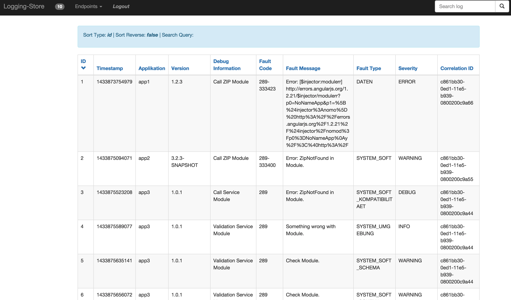
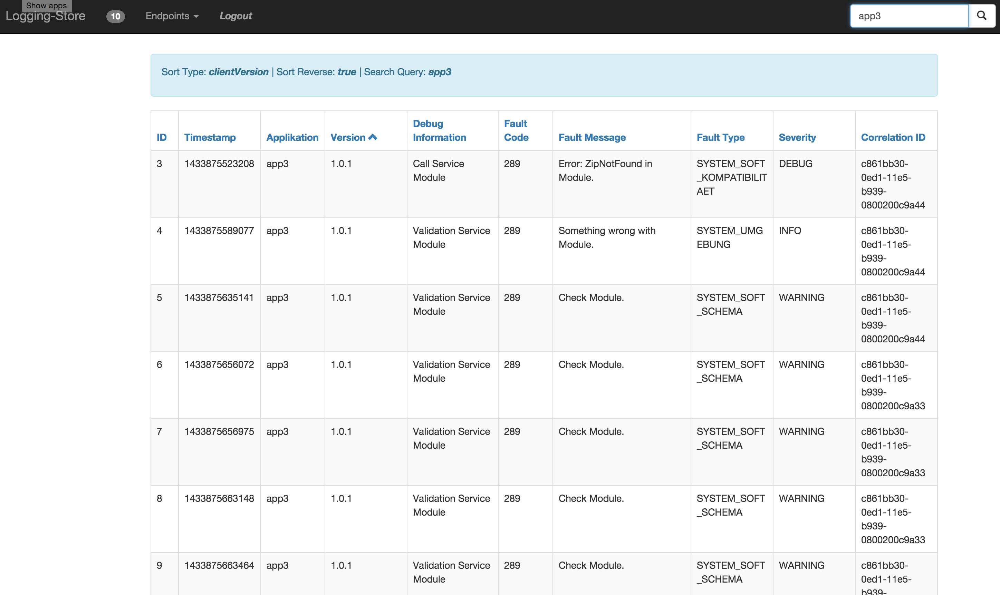
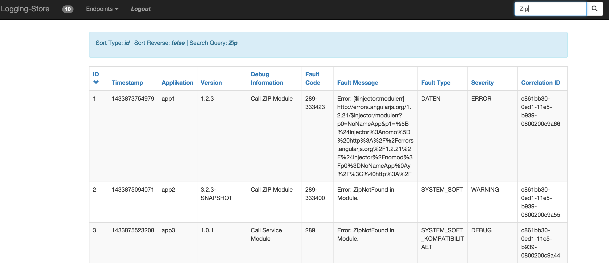
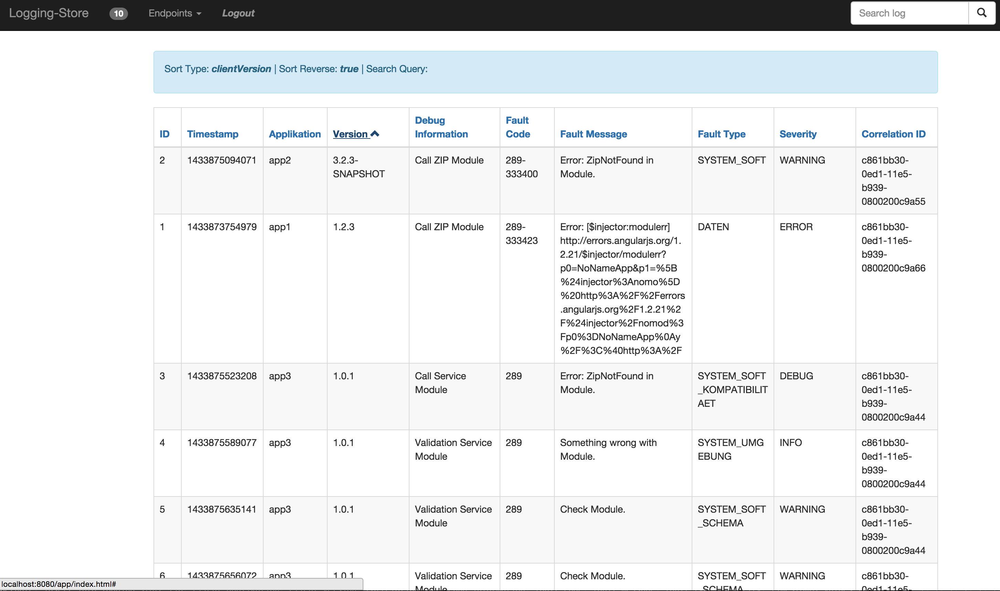

content from _src/docs/asciidoc/logviewer/manual.adoc_.

== Login
[.thumb]
image:../images/login.png[scaledwidth=50%]

== Logging-Store
[.thumb]

=== Query
==== app3
[.thumb]

==== ZIP
[.thumb]

=== Sort
==== version
[.thumb]

